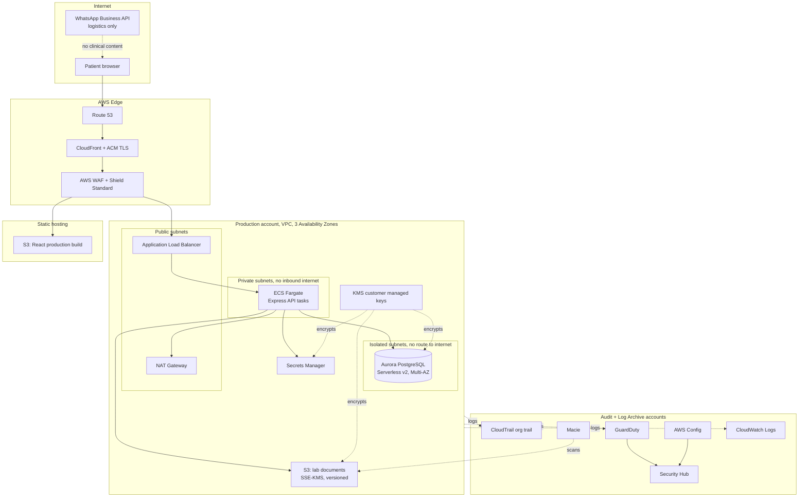

# JIVA: Technology Stack, AWS Deployment, Security, and Regulatory Compliance

> **Prepared:** 2026-07-23
> **Status:** Working document for external presentation. Sections 1 through 6 describe engineering and security posture. Sections 7 through 10 describe legal and regulatory obligations.
> **Scope:** JIVA precision wellness platform, primary market Costa Rica, expansion market Latin America.
>
> **Important caveat.** This document was prepared by the engineering team from primary sources and public legal commentary. It is not legal advice. Every item in sections 7 through 10 marked **[COUNSEL]** requires sign off from Costa Rican counsel and, for expansion markets, local counsel in each jurisdiction, before launch. Where our research surfaced genuine ambiguity we have said so rather than paper over it.

---

## Contents

1. [Executive summary](#1-executive-summary)
2. [What JIVA actually processes](#2-what-jiva-actually-processes)
3. [Current technology stack](#3-current-technology-stack)
4. [Target AWS architecture](#4-target-aws-architecture)
5. [Security program](#5-security-program)
6. [Certification roadmap: SOC 2, ISO 27001, HIPAA, PCI](#6-certification-roadmap)
7. [Costa Rica: legal and regulatory](#7-costa-rica-legal-and-regulatory)
8. [Latin America: country by country](#8-latin-america-country-by-country)
9. [Cross border data transfer strategy](#9-cross-border-data-transfer-strategy)
10. [Third party and vendor register](#10-third-party-and-vendor-register)
11. [Delivery roadmap](#11-delivery-roadmap)
12. [Open questions](#12-open-questions)
13. [Sources](#13-sources)

---

## 1. Executive summary

**The one fact that drives every decision in this document:** JIVA processes laboratory biomarker values, an intake questionnaire covering conditions and medications, and machine generated clinical findings. Under Costa Rican law and under every Latin American data protection regime we surveyed, that is **sensitive personal data**. Sensitive data carries a higher consent standard, a higher security standard, and in several jurisdictions a mandatory impact assessment before processing begins. Architecture, hosting, vendor selection, and even marketing copy all follow from that classification.

**Where we are.** JIVA is a working full stack application: React and Vite on the front end, Node, Express, Sequelize and PostgreSQL on the back end, orchestrated with Docker Compose. It runs the complete patient journey today: intake questionnaire, panel selection, payment, lab scheduling, results ingestion, the Vitality Map, the retest loop, and the action plan. The clinical analysis is produced by a large language model prompt that runs **offline**, and the application ingests pre computed JSON. The application makes no model call at runtime. That is a meaningful compliance advantage and we recommend preserving it.

**What it is not.** The current build is a demo. It is containerised and cloud portable, with no exotic infrastructure dependencies, so the path to production is short. But it has not been hardened. Section 5.3 lists sixteen specific issues we found by reading our own code, including a secret committed to the repository and a schema that drops and recreates itself on every container start. We list them openly because a partner who cannot see our gap list has no way to judge our rigour.

**Target hosting.** AWS, multi account, built with Control Tower. ECS Fargate for the API, Aurora PostgreSQL Serverless v2 in isolated subnets, CloudFront and S3 for the front end, customer managed KMS keys throughout, GuardDuty and Security Hub for detection, and infrastructure defined entirely as code. Primary region **us-east-1**, with a documented trigger for moving to a Latin American region (section 4.3). No Costa Rican law requires local data residency; the transfer is made lawful through express consent plus contractual safeguards.

**Certification.** One correction to a common assumption up front: **SOC 1 is almost certainly not the report JIVA needs.** SOC 1 covers controls relevant to a client's financial reporting. It applies to payroll bureaux, claims processors, and similar. The report that health data partners, enterprise buyers and investors ask for is **SOC 2 Type II**. Our recommendation is SOC 2 Type I at roughly month six, then a Type II observation window closing around month twelve, with ISO 27001 held in reserve for enterprise or European demand. SOC 1 enters the picture only if JIVA later processes transactions that flow into a client's financial statements, for example corporate wellness billing on behalf of an employer. Section 6 sets out the reasoning and the cost envelope.

**Costa Rican compliance.** Law 8968 and Executive Decree 37554-JP govern. The practical obligations are: express and, for health data, **written** consent; a five business day response deadline on access, rectification, deletion and objection requests; documented technical and organisational security measures; a designated responsible party; and a lawful basis for any transfer outside Costa Rica. Two items need a counsel decision rather than an engineering decision: whether JIVA must register its database with PRODHAB (section 7.2), and whether the JIVA engine is regulated software under RTCR 505:2022 (section 7.5). The second is the sharper of the two and we treat it as the single largest regulatory risk in the business.

**Regional strategy.** Build to the strictest regime, not the local one. Brazil's LGPD and Chile's Law 21.719, which takes effect 1 December 2026, are together the high water mark: mandatory breach notification, mandatory data protection impact assessments for health data, standard contractual clauses for international transfer, and a real regulator with fining power. A platform that satisfies those two satisfies Costa Rica, Colombia, Peru, Mexico and Argentina with configuration changes rather than rebuilds.

---

## 2. What JIVA actually processes

Every compliance conversation should start here, because the obligations attach to the data and not to the technology.

| Category | Specific fields | Classification | Where it lives today |
| --- | --- | --- | --- |
| Account identity | Name, first and last name, email, phone, bcrypt password hash, role | Personal data | `Users` table |
| Demographics | Age, sex, external patient identifier, collection date | Personal data | `PatientProfiles` table |
| Intake questionnaire | Conditions, medications, allergies, diet type, cultural and religious food restrictions, disliked foods, lifestyle answers | **Sensitive** (health, and in part religious belief) | `Questionnaires.data`, JSONB |
| Laboratory results | Up to 112 biomarker values with units and reference ranges, per draw | **Sensitive** (health) | `TestResults`, `Biomarkers`, `ReferenceRanges` |
| Report rollup | Biological age, in range and out of range counts, critical alerts, patient summary | **Sensitive** (health) | `LabReports` table |
| **Clinical findings** | Ranked diagnoses with confidence levels and supporting labs, for example "Polycystic Ovary Syndrome, Hyperandrogenic Phenotype" | **Sensitive, highest tier** | `Diagnoses` table |
| Recommendations | Foods to eat and avoid, exercise, supplements, per system summaries | **Sensitive** (derived from health data) | `FoodRecommendation`, `ExerciseRecommendation`, `SupplementRecommendation`, `SystemSummary` |
| Commercial | Panel selection, order total, order status | Personal data | `Orders` table. **No card data is stored.** |
| Operational | Appointment date and lab location, retest due dates, JWT session tokens, request logs | Personal data | `Appointments`, application logs |

**Three consequences of this inventory that a partner should hear explicitly:**

1. **The `Diagnoses` table is the most sensitive object in the system.** By design the patient never sees it; the engine hides clinical labels behind a non diagnostic recommendation layer. That is good product design and it also means the table needs the tightest access control in the platform: no broad read access, no export path, and every read logged with the identity of the reader.

2. **The questionnaire captures religious and cultural food restrictions.** In several regimes, religious belief is its own sensitive category, separate from health. It is captured for a legitimate purpose (the engine must never recommend food that violates a patient's restrictions, which is Prime Directive 5 of the engine prompt) but the consent language must cover it explicitly.

3. **JIVA holds no cardholder data and should keep it that way.** Section 7.7 covers keeping payment card scope out of the platform entirely.

---

## 3. Current technology stack

As built and verified in the repository on 2026-07-23. Roughly 30,000 lines across 85 commits.

### 3.1 Application

| Layer | Technology | Version | Notes |
| --- | --- | --- | --- |
| Front end framework | React | 19.1 | Function components, hooks, no class components |
| Build tool | Vite | 7.0 | TypeScript 5.8, strict mode |
| UI system | MUI (Material UI) | 7.3 | With Emotion and styled-components |
| Routing | React Router | 7.7 | Client side |
| Charts | ApexCharts | 5.6 | Via react-apexcharts |
| Animation | GSAP, anime.js, Framer Motion | 3.15 / 4.5 / 12.4 | Marketing surfaces only |
| API layer | Express | 5.2 | Node 20 LTS on Alpine |
| ORM | Sequelize | 6.37 | 21 models |
| Database | PostgreSQL | 16 | JSONB used for the flexible questionnaire block |
| Authentication | jsonwebtoken 9, bcryptjs 3 | | Hand rolled, see section 5.3 |
| Terminology service | WHO ICD-11 API | Self hosted container | Analytics explicitly disabled |
| Local orchestration | Docker Compose | 4 services | db, icd-api, backend, frontend |

### 3.2 The clinical engine

The engine is **a prompt, not a service**. `Data/Engine/jiva_engine_prompt_v5.md` is a large language model system prompt that takes a patient's labs and questionnaire and emits a fixed JSON schema: exactly three internal diagnoses, fifteen foods to eat, ten to avoid, three exercises, five supplements, and per system summaries across ten canonical functional systems.

Three properties of this design matter for compliance:

- **It runs offline.** Outputs are generated ahead of time and ingested by the application. There is no runtime model call, therefore no runtime transfer of patient data to a model provider, therefore no third party processor in the live data path today. If this changes, section 10 sets out what would then be required.
- **It is deterministic in shape.** The output schema is fixed and validated, which makes the analysis auditable in a way a free form model response would not be.
- **It separates the diagnostic layer from the patient facing layer by design.** Prime Directive 11 of the prompt forbids exposing any diagnostic label to the patient. This separation is the core of our position on the medical device question in section 7.5, so it needs to be preserved deliberately rather than by accident.

### 3.3 Honest assessment of production readiness

| Area | Demo | Production ready |
| --- | --- | --- |
| Functional completeness of the patient journey | Yes | Yes |
| Data model | Yes | Yes, needs migrations |
| Containerisation | Yes | Back end yes, front end no (dev server) |
| Schema management | `sync({ force: true })` on every boot | **No.** Needs migration tooling |
| Secrets management | Committed to the repository | **No.** See 5.3 |
| Authentication hardening | Basic | **No.** See 5.3 |
| Audit logging | None | **No.** Required for SOC 2 and Law 8968 |
| Automated tests | None | **No.** Required for change management evidence |
| Infrastructure as code | None | **No.** Required for reproducibility and audit |

---

## 4. Target AWS architecture

### 4.1 Principles

1. **Nothing that holds patient data is reachable from the internet.** The database sits in isolated subnets with no route to an internet gateway.
2. **Every environment is created from code.** No console clicking in production. Terraform or AWS CDK, reviewed and version controlled.
3. **No long lived credentials anywhere.** IAM Identity Center for humans, task roles for services, GitHub OIDC for the pipeline. Zero IAM users with access keys.
4. **Encryption is not optional and not defaulted.** Customer managed KMS keys per environment, so key usage is independently auditable and revocable.
5. **Region portability is a design constraint,** because the residency answer may change (section 4.3). No region locked services in the critical path.
6. **Logs are written where the people who could tamper with them cannot reach.** A separate log archive account, write only from workloads.

### 4.2 Account structure

Built with AWS Control Tower, which gives a governed multi account landing zone out of the box.

| Account | Purpose |
| --- | --- |
| Management | Organizations root, billing, Control Tower. No workloads. |
| Log archive | Centralised CloudTrail, Config, VPC Flow Logs, ALB and WAF logs. Immutable, cross account write only. |
| Audit / security | GuardDuty, Security Hub, Detective, Macie administrator. Read only into workload accounts. |
| Shared services | ECR registry, CI/CD roles, artefact store. |
| Production | Patient data. Tightest controls. Break glass access only. |
| Staging | Production shaped, **synthetic data only**. |
| Development | Synthetic data only. |

**Service control policies** enforced at the organisation level: deny disabling of CloudTrail, GuardDuty or Config; deny creation of unencrypted EBS volumes, RDS instances or S3 buckets; deny public S3 access; deny operation outside approved regions; deny root user activity except break glass.

**A rule we will state plainly to any partner: production patient data never leaves the production account.** No copying to staging for debugging. Reproduction of production issues uses synthetic fixtures.

### 4.3 Region strategy and the residency question

There is no AWS region in Costa Rica or anywhere in Central America. The options and the trade off:

| Option | Latency from Costa Rica | Service coverage | Residency story |
| --- | --- | --- | --- |
| **us-east-1** (N. Virginia) | Best, roughly 40 to 70 ms | Complete, every service at launch | Data leaves Latin America |
| **mx-central-1** (Mexico) | Good, closest Latin American region | Newer, thinner service coverage | Data stays in Latin America |
| **sa-east-1** (São Paulo) | Poor, roughly 120 to 160 ms | Mature, broad | Data stays in Latin America, strongest for a Brazil market |
| **South America (Chile)** | Poor for Costa Rica | Announced for end of 2026, three Availability Zones at launch | Future option |

**Our recommendation: us-east-1 as primary,** for three reasons. First, **no Costa Rican law imposes a data residency requirement.** Law 8968 regulates the *conditions* of an international transfer, not the *fact* of it, and express consent is one of the recognised bases. Second, latency to the Costa Rican user base is materially better, and this is a consumer product where page speed is a conversion variable. Third, service and feature coverage in us-east-1 is complete, which matters for a small team that cannot afford to work around regional gaps.

**Documented triggers to move primary to mx-central-1 or sa-east-1:**

- Brazil becomes a material market. LGPD international transfer rules bite harder and a domestic region simplifies the argument.
- A lab, hospital or enterprise partner makes Latin American residency a contractual condition.
- Costa Rican Bill 23097 passes with a residency or localisation provision. It currently has none, but it is a GDPR aligned rewrite and worth watching.
- A public sector or CCSS linked opportunity arises, where residency expectations are typically stricter.

Because infrastructure is defined as code and no region locked service sits in the critical path, this move is a matter of weeks, not a re platforming. **We would rather state the trade off openly and show the trigger conditions than claim a residency posture we have not committed to.**

Disaster recovery replicates to a second region regardless of which is primary.

### 4.4 Architecture

### 4.5 Compute and delivery

- **API: ECS Fargate.** No servers to patch, no SSH, immutable task definitions, one task role per service. Auto scaling on CPU and request count. The current Express application containerises unchanged.
- **Front end: S3 plus CloudFront.** The production build, not the Vite dev server currently baked into the container. Origin Access Control so the bucket is never public. A strict Content Security Policy, HSTS with preload, `X-Content-Type-Options`, and `Referrer-Policy` set at the edge.
- **WAF** in front of both distributions: AWS managed core rule set, known bad inputs, SQL injection and Linux rule sets, plus a rate based rule on `/api/auth/*` to blunt credential stuffing.
- **Blue/green deployment** through CodeDeploy so a bad release rolls back automatically on alarm.

### 4.6 Data layer

- **Aurora PostgreSQL Serverless v2**, Multi-AZ, in isolated subnets. Encrypted at rest with a customer managed KMS key. TLS enforced in transit with certificate verification, which the current Sequelize configuration does not do and must.
- **Point in time recovery** with a 35 day window. Automated snapshots copied to the DR region, encrypted with a separate key.
- **Credentials in Secrets Manager** with automatic rotation. The application reads them at task start through its task role. No database password ever appears in an environment file, a repository, or a compose file.
- **Schema changes through migrations** (Umzug or Sequelize CLI), reviewed and applied in the pipeline. The `sequelize.sync({ force: true })` call in `scripts/seedDemo.js` is a demo convenience that drops every table; it must be structurally impossible for it to run against production, enforced by an environment guard and by the seed script simply not being present in the production image.
- **S3 for lab documents** when uploads land (backlog item F23 in `Additional_Functionality.md`): SSE-KMS, versioning, Block Public Access at account level, lifecycle to Glacier, and Macie scanning for accidentally uploaded identifiers.
- **Retention.** Law 8968 requires that data no longer necessary for its purpose be deleted or anonymised. Longitudinal wellness legitimately needs long retention, but "forever" is not a defensible answer. Section 7.1 sets the policy target.

### 4.7 Identity

Our recommendation is to **migrate authentication to Amazon Cognito** rather than continue with the hand rolled JWT implementation. The reasoning is not that the current implementation is wrong in principle, but that Cognito supplies, at no engineering cost, several things that a SOC 2 auditor will ask for and that we would otherwise have to build and then prove: enforced MFA, configurable password policy with a compromised credentials check, account lockout, token revocation, refresh token rotation, device tracking, and a complete authentication audit trail.

The specific gaps this closes are listed in section 5.3, items 2, 3, 10, 11 and 12. In particular, the current two factor flow accepts **any six digit code** (a documented demo stub in `authController.js`). Shipping a two factor toggle that does not authenticate anything would be worse than shipping no toggle at all, so this is a launch blocker either way.

Administrative access to AWS is through **IAM Identity Center** with MFA required, short lived session credentials, permission sets scoped per role, and a single break glass account whose use raises an alarm.

### 4.8 Observability and detection

| Capability | Service | Configuration |
| --- | --- | --- |
| API and console audit | CloudTrail | Organisation trail, all regions, management and data events, log file validation on, delivered to the log archive account |
| Threat detection | GuardDuty | All accounts, with S3, RDS and runtime monitoring protection plans |
| Posture management | Security Hub | AWS Foundational Security Best Practices, CIS AWS Foundations, plus a custom SOC 2 aligned standard |
| Configuration drift | AWS Config | Conformance packs, auto remediation for public S3 and unencrypted volumes |
| Vulnerability scanning | Amazon Inspector | Continuous scanning of ECR images and Fargate tasks |
| Sensitive data discovery | Macie | Scheduled scans of document buckets |
| Network flow | VPC Flow Logs | All VPCs, to the log archive account |
| Application logs | CloudWatch Logs | Structured JSON, **with a PHI redaction filter at the logging layer** |

**Two application level requirements that AWS cannot supply and we must build:**

1. **A patient data access log.** Every read of a `LabReport`, `Diagnosis`, `Questionnaire` or `TestResult` record, recording who, what, when, and from where. This is required both by SOC 2 and by our ability to answer a patient asking who has seen their results. It does not exist today.

2. **Log redaction.** Several controllers currently return `error.message` straight to the client and log raw errors, which can leak query fragments containing patient values. Errors must be sanitised at the boundary and structured logs must pass through a redaction filter before they reach CloudWatch.

### 4.9 Pipeline and change management

- GitHub Actions authenticating to AWS through **OIDC federation**. No stored AWS keys.
- On every pull request: lint, type check (`tsc --noEmit`), unit and integration tests, dependency audit, secret scanning (Gitleaks), static analysis (CodeQL or Semgrep), Terraform plan and policy check (Checkov or tfsec).
- On merge to main: build, push to ECR with immutable tags, Inspector scan gate, deploy to staging, run smoke tests.
- Production deploy requires **a second human approval**, recorded. This single control satisfies a surprising share of a SOC 2 change management section.
- Branch protection on `main`: no direct pushes, required review, required status checks. This is the evidence an auditor samples.

### 4.10 Resilience

| Objective | Target | Mechanism |
| --- | --- | --- |
| Recovery time (RTO) | 4 hours | Multi-AZ Aurora, Fargate re launch, infrastructure recreated from code |
| Recovery point (RPO) | 5 minutes | Aurora continuous backup, point in time recovery |
| Regional loss RTO | 24 hours | Cross region snapshot copy, IaC redeploy |
| Backup restore verification | Quarterly | Documented restore drill into an isolated account |

The quarterly restore drill matters more than it sounds. Untested backups are the most common finding in early stage security reviews, and a documented drill is cheap evidence.

### 4.11 Indicative running cost

Early stage, production plus staging, before volume:

| Component | Monthly estimate (USD) |
| --- | --- |
| Aurora Serverless v2 (production, min 0.5 ACU) | 90 to 220 |
| ECS Fargate (2 to 4 tasks) | 60 to 140 |
| ALB, NAT Gateway, data transfer | 70 to 110 |
| CloudFront and S3 | 15 to 40 |
| GuardDuty, Security Hub, Config, Inspector, Macie | 90 to 180 |
| Secrets Manager, KMS, CloudWatch, CloudTrail | 40 to 80 |
| Staging environment (scaled down, off hours stopped) | 60 to 120 |
| **Total** | **425 to 890** |

Roughly a third of that is the security and compliance tooling. That is the cost of being auditable, and it is worth naming separately rather than burying it.

---

## 5. Security program

### 5.1 Shared responsibility

AWS secures the cloud: physical facilities, hardware, the hypervisor, the managed service control plane. AWS maintains SOC 1, SOC 2, SOC 3, ISO 27001, ISO 27017, ISO 27018, ISO 27701, PCI DSS Level 1 and HITRUST CSF attestations, and makes the reports available through **AWS Artifact**.

JIVA secures what runs in the cloud: identity and access, network configuration, encryption choices, operating system and application patching where applicable, application logic, and the data itself.

**The distinction we will make explicitly to any partner: AWS's certifications are inputs to ours, not substitutes for them.** Inheriting AWS's SOC 2 does not make JIVA SOC 2 compliant. It means the infrastructure layer of our own audit is already evidenced, which typically removes a meaningful share of the work but none of the obligation.

### 5.2 Control domains

Mapped to the SOC 2 Trust Services Criteria and ISO 27001 Annex A, so the same control set serves both.

| Domain | Control | Implementation | Evidence |
| --- | --- | --- | --- |
| Access control | MFA on all human access | IAM Identity Center, Cognito for patients | Identity Center report, Cognito config |
| Access control | Least privilege, no standing admin | Permission sets, task roles, quarterly access review | Access review records |
| Access control | Joiner, mover, leaver | HR triggered, documented within one business day | Ticket history |
| Encryption | At rest, customer managed keys | KMS CMK per environment, key rotation on | KMS policies, Config rules |
| Encryption | In transit | TLS 1.2 minimum at the edge, TLS to the database with verification | ALB policy, connection config |
| Network | Defence in depth | Public, private and isolated subnets; security groups default deny; no public database | VPC diagram, Config rules |
| Application | Secure development | Code review required, SAST, dependency scanning, secret scanning in CI | Pipeline logs, branch protection |
| Application | Input validation and output encoding | Schema validation at every endpoint, parameterised queries via Sequelize | Code review, test suite |
| Application | Rate limiting and abuse prevention | WAF rate rules plus application level limits on auth endpoints | WAF logs |
| Logging | Immutable audit trail | CloudTrail with log file validation, separate account | CloudTrail config |
| Logging | Patient data access trail | Application level access log (**to build**) | Access log samples |
| Monitoring | Detection and alerting | GuardDuty, Security Hub, CloudWatch alarms into on call | Alert history |
| Vulnerability management | Continuous scanning | Inspector on images and tasks, Dependabot on dependencies | Scan reports, remediation SLA |
| Vulnerability management | Annual penetration test | Third party, with remediation tracked to closure | Test report, retest |
| Incident response | Documented plan | Severity matrix, roles, comms tree, **regulator notification clock** | Plan document, tabletop records |
| Incident response | Tested | Annual tabletop, minimum | Exercise notes |
| Business continuity | Backup and restore | Automated, cross region, quarterly restore drill | Drill records |
| Personnel | Background checks and training | Pre hire screening, security training on hire and annually | HR records, training completion |
| Vendor management | Third party risk | Register, DPAs, annual review of critical vendors | Vendor register (section 10) |
| Change management | Controlled release | PR review, CI gates, second approval to production | Deployment records |
| Data governance | Classification, retention, deletion | Documented policy, automated retention jobs | Policy, job logs |

### 5.3 Application gaps found in our own code

We read the repository specifically to produce this list. These are the items that stand between the current build and a production system holding real patient data. Each is small individually; together they are the honest answer to "is this ready".

| # | Finding | Where | Severity | Fix |
| --- | --- | --- | --- | --- |
| 1 | **`JIVA_Node_App/.env` is committed to git** and contains `JWT_SECRET`. The same secret (`supersecretjivatoken`) is also hardcoded in `docker-compose.yml`. | Repository | **Critical** | Rotate the secret, remove the file from git history, move to Secrets Manager, add `.env` to `.gitignore`, enable push protection and secret scanning |
| 2 | JWT lifetime is 30 days with no refresh rotation and no revocation list. A stolen token is valid for a month and cannot be recalled. | `authController.js` | High | Short lived access token plus rotating refresh token, server side revocation. Solved by Cognito |
| 3 | The token is stored in `localStorage` as well as in an HttpOnly cookie. `localStorage` is readable by any injected script. | 13 front end call sites | High | Use the HttpOnly cookie only, remove the `localStorage` copy |
| 4 | **Intake questionnaire answers are drafted to `localStorage` before signup**, so health data sits unencrypted in the browser and persists after the session. | `questionnaire/storage.ts` | High | Encrypt the draft or hold it in memory; clear on submit and on tab close; disclose it in the privacy notice if retained |
| 5 | No `helmet`, no rate limiting, no request validation library, and no CSRF token despite cookie based authentication. | `server.js` | High | Add helmet, express-rate-limit, a schema validator (Zod), and CSRF protection on cookie authenticated state changing routes |
| 6 | `sequelize.sync({ force: true })` runs on **every container start**, dropping and recreating all tables. | `scripts/seedDemo.js`, `Dockerfile` | **Critical** if it ever reaches production | Migrations only; seed script excluded from the production image; environment guard |
| 7 | The front end container runs the **Vite dev server** in production mode. | `JIVA_React_App/Dockerfile` | High | Production build to S3 and CloudFront |
| 8 | CORS origin is hardcoded to `http://localhost:5174`. | `server.js` | Medium | Environment driven allowlist |
| 9 | Cookie `secure` flag is conditional on `NODE_ENV === 'production'`. | `authController.js` | Medium | Secure and SameSite unconditional outside local development |
| 10 | bcrypt cost factor 10, no password policy, no compromised credential check. | `authController.js` | Medium | Cost 12 minimum, policy enforcement, breach list check. Solved by Cognito |
| 11 | No account lockout or brute force protection on `POST /api/auth/login`. | `authRoutes.js` | High | Rate limit plus progressive lockout. Solved by Cognito |
| 12 | **Two factor authentication accepts any six digit code.** Documented as a demo stub. | `authController.js` `verifyPhone` | **Critical** if shipped | Wire a real provider, or remove the control from the UI until it is real |
| 13 | No audit trail of who accessed which patient record. | Application wide | High | Build the access log described in 4.8 |
| 14 | No automated tests. `npm test` exits with an error. | `package.json` | Medium | Test suite covering auth, authorisation boundaries and the report pipeline. Also a SOC 2 change management evidence gap |
| 15 | Several controllers return `error.message` directly to the client. | Multiple controllers | Medium | Sanitise at the boundary, log detail server side only |
| 16 | No data export or deletion endpoint. Law 8968 requires a response within **five business days**. | Application wide | High | Build `GET /api/me/export` and a verified deletion workflow with a documented retention exception path |

**On the two items marked Critical that are already true today:** the committed secret is only a demo secret guarding a demo database, and the destructive sync is a deliberate demo convenience documented in the file. Neither is negligence in a demo. Both are absolute blockers for production, and we would rather a partner hear that from us than find it themselves.

---

## 6. Certification roadmap

### 6.1 SOC 1 or SOC 2: the honest answer

| Report | What it attests | Who asks for it | Does JIVA need it |
| --- | --- | --- | --- |
| **SOC 1** | Controls relevant to a **client's financial reporting** | External auditors of a client whose financial statements depend on your processing | **Not now.** JIVA does not process transactions that flow into a client's financial statements |
| **SOC 2 Type I** | Design of security controls **at a point in time** | Early enterprise buyers, partners doing initial diligence | **Yes, first milestone** |
| **SOC 2 Type II** | **Operating effectiveness** over a 6 to 12 month window | Serious enterprise buyers, health partners, most investors | **Yes, the real target** |
| SOC 3 | Public summary of SOC 2 | Marketing and website use | Optional, cheap once Type II exists |

SOC 1 becomes relevant only if JIVA later takes on processing that feeds a client's books, for example invoicing employees on behalf of a corporate wellness client (backlog item F29). If a partner in the room asks for SOC 1, the useful follow up question is what they actually need it for, because in nine cases out of ten the answer describes SOC 2.

**Recommended Trust Services Criteria for the SOC 2:** Security (mandatory), Availability, and Confidentiality. Add **Privacy** if the audience is regulated health partners; it is more work but it maps closely to the Law 8968 obligations we have to meet anyway, so the marginal cost is lower for JIVA than for a typical SaaS company.

### 6.2 Sequence and cost envelope

| Milestone | Timing | Indicative cost (USD) |
| --- | --- | --- |
| Compliance automation platform (Vanta, Drata or similar) | Month 1 | 10,000 to 25,000 per year |
| Policy set, risk assessment, vendor register | Months 1 to 3 | Internal, plus 5,000 to 15,000 if outsourced |
| Remediate section 5.3, build audit logging and rights endpoints | Months 1 to 4 | Internal engineering |
| Third party penetration test | Month 5 | 10,000 to 25,000 |
| **SOC 2 Type I audit** | Month 6 | 15,000 to 30,000 |
| Type II observation window opens | Month 6 | Operating cost only |
| **SOC 2 Type II report** | Month 12 to 14 | 20,000 to 40,000 |
| ISO 27001 (only if demanded) | Month 15 onward | 30,000 to 60,000 plus surveillance |

**First year total, realistic range: 60,000 to 135,000 USD** including tooling, testing and audit fees, excluding internal engineering time. The single largest lever on that number is how much of the section 5.3 remediation is done before the auditor arrives.

### 6.3 HIPAA

HIPAA is a United States statute that binds covered entities (providers, plans, clearinghouses) and their business associates. **A direct to consumer wellness platform operating in Costa Rica is very unlikely to be a covered entity or a business associate,** so HIPAA does not apply by default.

Three situations would change that, and all three are plausible given JIVA's medical tourism positioning:

1. A contract with a United States provider or plan in which JIVA handles protected health information on their behalf, creating business associate status.
2. A United States employer client whose group health plan is in scope.
3. Servicing United States residents at scale, which brings state law into play even without HIPAA. **Washington's My Health My Data Act is the one to watch**: it covers consumer health data outside HIPAA, requires separate consent for collection and for sharing, and carries a private right of action.

**Recommendation: build to HIPAA technical safeguard equivalence without claiming HIPAA compliance.** Encryption, access control, audit controls, integrity controls and transmission security are the same controls SOC 2 and Law 8968 already require. Execute the **AWS Business Associate Addendum** and restrict the architecture to HIPAA eligible services now, because both are free and doing it later means re architecting. Do not put "HIPAA compliant" on the website; it is a claim regulators and buyers both test.

### 6.4 PCI DSS

**The goal is to have almost no PCI scope at all.** Use a payment service provider with hosted fields or a hosted redirect, so cardholder data never touches JIVA infrastructure and the assessment is the shortest self assessment questionnaire (SAQ A). The current `Order` model stores only package identifiers, a total and a status, with no card data, which is exactly right. Preserve that boundary when the real payment integration lands (backlog item F18). Any design that posts a card number to the JIVA API pulls the entire platform into PCI scope and should be rejected on that basis alone.

---

## 7. Costa Rica: legal and regulatory

### 7.1 Law 8968 and Executive Decree 37554-JP

Law No. 8968, *Ley de Protección de la Persona frente al Tratamiento de sus Datos Personales*, published 5 September 2011, with implementing Decree 37554-JP. Enforced by **PRODHAB** (Agencia de Protección de Datos de los Habitantes). Health data is expressly a **sensitive** category.

| Obligation | What it requires | JIVA product and engineering change | Status |
| --- | --- | --- | --- |
| **Informed consent** (art. 5) | Prior, express, informed. **Written consent for sensitive data.** Purpose specific, revocable. | Consent step at intake with versioned text, separate affirmative consent for health data processing, for international transfer, and for any marketing. Store consent version, timestamp and IP against the user record. | To build |
| **Duty to inform** | Identity of the controller, purpose, categories, recipients, rights, whether provision is mandatory | Privacy notice in Spanish (es-CR) as the source language, linked at every collection point | To build |
| **Data quality** | Adequate, relevant, not excessive; accurate and current | Already reasonable; the questionnaire collects only what the engine consumes. Document the justification per field | Largely met |
| **Retention limits** | Delete or anonymise when no longer necessary | Written retention schedule. Proposed: account data for the life of the account plus 12 months; clinical results retained for the longitudinal purpose the patient consented to, with a stated period (we suggest 10 years, aligned to clinical record norms) and an explicit patient facing statement | **[COUNSEL]** confirm the period |
| **Security** (art. 10) | Technical and organisational measures against alteration, loss, destruction or unauthorised access | Section 4 and 5 in full | In progress |
| **Communication of irregularities** (art. 10) | Inform the data subject of any irregularity in processing or storage, including loss or a security vulnerability | Incident response plan with a defined patient notification path and template | To build |
| **Rights of access, rectification, deletion and objection** | Response within **five business days** | Self service export and deletion in the account area, plus a monitored `privacidad@` inbox with a tracked five day SLA. **Five business days is short; this must be substantially automated** | To build |
| **Designated responsible party** | A named accountable person or external data protection officer | Appoint before launch. Name and contact published in the privacy notice | **[COUNSEL]** |
| **International transfer** | Adequacy determination by PRODHAB, or a derogation: express consent, contractual necessity, public interest, legal claims, vital interests | Rely on **express consent plus contractual safeguards**, captured in the intake consent, and a data processing agreement with AWS. See section 9 | To build |
| **Database registration** | Required for those who distribute, disclose or commercialise personal data. Internal use databases are exempt | See 7.2 | **[COUNSEL]** |

**Penalties.** Graduated by severity and expressed in *salarios base*: minor infractions up to roughly 5 base salaries, serious 5 to 20, very serious 15 to 30, with the possibility of suspending operation of the offending database for one to six months. At the 2026 base salary of approximately 462,200 colones, the maximum is in the region of 25,000 to 28,000 USD. **The financial exposure is modest; the operational exposure, a suspension order against the database, is the one that would actually stop the business.** That asymmetry is worth stating internally, because it changes how the risk should be weighted.

**Reform watch.** Bill 23097, introduced in May 2022, would replace Law 8968 with a GDPR aligned regime. It received a commission report in early 2025 and has not passed as of this writing. It is expected to introduce mandatory breach notification to the regulator, broader registration duties, and higher penalties. **We should build to the bill, not to the current law.** The delta is small if we are already building to LGPD and Chile 21.719, and it removes a future migration.

### 7.2 The PRODHAB registration question **[COUNSEL]**

This is genuinely ambiguous and we do not want to overstate our reading.

The registration duty in Law 8968 attaches to those who maintain databases **for purposes of distributing, disclosing or commercialising** personal data. Databases held for a controller's own internal purposes are exempt, as are SUGEF supervised financial institutions.

- **The argument that JIVA is exempt:** JIVA collects patient data to deliver a service to that same patient. It does not sell, broker or publish personal data. On a plain reading, this is internal use.
- **The argument that JIVA must register:** JIVA necessarily discloses patient identity and panel selection to a partner laboratory, and receives results back. Whether routine disclosure to a service partner constitutes "disclosure" in the statutory sense is exactly the point on which counsel is needed.

**Our recommendation is to register anyway.** The fee is approximately 200 USD per database per year. Registering costs less than the memo arguing we do not have to, removes a serious infraction from the risk register, and reads well to partners and to the regulator. We would only revisit this if counsel identifies a downside to registration that we have not seen.

### 7.3 Breach response

Law 8968 article 10 obliges the controller to inform the **data subject** of irregularities in processing or storage. Unlike GDPR, the statute does not set a fixed clock for notifying the regulator, and commentary we reviewed is not consistent on what deadline applies in practice. Bill 23097 would introduce an explicit obligation.

**Rather than argue about the deadline, we set our own and make it the strictest one in our markets.** Brazil's LGPD requires communication to the ANPD and to data subjects within **three days** of becoming aware of a security incident. That is the tightest number in the region, so it becomes the JIVA internal standard: **regulator and data subject notification decision within 72 hours of confirmed awareness, in every market.** This is simpler to operate than per country clocks and it will not be wrong anywhere.

### 7.4 Health sector regulation

| Area | Instrument | Relevance to JIVA |
| --- | --- | --- |
| Clinical laboratory operation | Executive Decree 41742 and Ministry of Health authorisation; professional oversight by the Colegio de Microbiólogos y Químicos Clínicos | **The partner laboratory's obligation, not JIVA's.** But JIVA must verify authorisation as part of vendor onboarding and record the evidence. A partner operating without authorisation is JIVA's problem commercially and reputationally |
| Clinical records | Ministry of Health record keeping norms and the *expediente digital único en salud* framework | JIVA is not a health provider today and does not keep a clinical record. **This changes the moment a clinician reviews results in the product** (backlog item F25) |
| Telehealth | *Reglamento de Telesalud*, Colegio de Médicos y Cirujanos de Costa Rica | Triggered by clinician review, async messaging with a care team, or any consultation feature (backlog items F25 and F26). Requires documented informed consent specific to telehealth, record keeping, and a licensed practitioner. **These features are currently PENDING in the backlog, and this regulation should be part of the decision on whether to build them** |
| Medical devices and software | **RTCR 505:2022**, Executive Decree 43902-S, Ministry of Health, submissions through the Registrelo platform | See 7.5 |
| Health advertising and claims | Ministry of Health advertising controls, plus consumer protection Law 7472 | Constrains marketing copy. No diagnostic or curative claims |

### 7.5 Is the JIVA engine a regulated medical device? **[COUNSEL, highest priority]**

RTCR 505:2022 governs *equipo y material biomédico* and expressly extends to **software and mobile applications for medical use**. The classification is risk based across four classes, with Class 1 generally exempt from sanitary registration and Classes 2 through 4 requiring registration before commercialisation. The line drawn in practice is that software with a **clinical purpose**, specifically monitoring or interpretation, is in scope, while wellness and lifestyle software is not.

**The JIVA engine sits close to that line, and where it falls is the single largest regulatory question in the business.**

Arguments that JIVA is out of scope:
- The patient facing layer is, by explicit design, **non diagnostic**. Prime Directive 11 of the engine prompt forbids exposing any diagnostic label, condition name, or anything that reads as a medical diagnosis. Patients see lab classifications and lifestyle recommendations.
- Recommendations are nutrition, movement and supplements. No treatment, no prescription, no dosing of medication.
- The output is positioned as wellness insight, not as a diagnosis or a basis for treatment.

Arguments that JIVA is in scope:
- The engine **does** interpret laboratory values, and interpretation is named in the in scope description.
- The engine internally produces ranked clinical diagnoses with confidence levels. That those are hidden from the patient does not automatically remove them from a regulator's view of what the software does.
- "Biological age" and out of range flagging are, functionally, health status assessments.

**Recommended actions, in order:**

1. **Obtain a written classification opinion** from Costa Rican regulatory counsel or a regulatory affairs consultancy before commercial launch. This should be the first legal spend, ahead of anything else in this document.
2. **Preserve the two layer separation deliberately.** It is currently a property of a prompt. It should become an architectural guarantee: the `Diagnoses` table is never exposed through any patient facing endpoint, enforced in code and covered by a test.
3. **Align marketing copy with the classification.** No language claiming to detect, diagnose, screen for or treat any condition. This constrains the growth team, so they need to hear it early rather than after the campaign is written.
4. **Carry a visible disclaimer** stating the product is not a substitute for medical care and does not provide a diagnosis.
5. **Plan for the possibility of a "yes".** If the classification comes back in scope, registration through Registrelo is a project measured in months, not weeks, and it changes the launch date. Better to know now.

### 7.6 Consumer, commercial and employment

- **Consumer protection, Law 7472.** Clear pricing, no misleading claims, honoured refund terms. Subscription and membership terms (backlog item F32) need particular care on renewal and cancellation disclosure.
- **Electronic commerce and electronic signature.** Terms of service must be accepted through an affirmative act with a retained record. Clickwrap with a stored consent version and timestamp, not browsewrap.
- **Accessibility.** Law 7600 obliges accessibility for persons with disabilities. Beyond compliance, WCAG 2.1 AA is the practical target and is far cheaper to build in than to retrofit.
- **Language.** Consumer facing documents in Spanish. This aligns with backlog item F19, which correctly argues that neutral Latin American Spanish should be the **source** locale rather than a translation of English.
- **Employment and outsourcing.** If any engineering is contracted outside Costa Rica, the data processing agreement chain must reach every party with access to production. See section 10.

### 7.7 Payments

SINPE Móvil is the dominant domestic rail: operated by the Central Bank, with over 2.5 million users and more than 65 million transactions a month. Installments (*cuotas*) are a significant conversion mechanism in the region.

Three requirements regardless of which provider is chosen:
1. **No cardholder data on JIVA infrastructure.** Hosted fields or redirect. This keeps PCI scope at SAQ A (section 6.4).
2. **The payment provider is a data processor** for the personal data it receives and needs a data processing agreement.
3. **Payment status must not leak health context.** An order record should reference a panel identifier, never a condition, a finding or a reason for testing.

---

## 8. Latin America: country by country

| Country | Law | Authority | Registration duty | Health data | Breach notification | Notes for JIVA |
| --- | --- | --- | --- | --- | --- | --- |
| **Costa Rica** | Law 8968 (2011) + Decree 37554-JP | PRODHAB | Yes, if distributing or commercialising. ~200 USD per database per year | Sensitive, **written** consent | To the data subject; no fixed statutory regulator clock | Reform Bill 23097 pending. See section 7 |
| **Brazil** | LGPD, Law 13.709 | ANPD | No general registry, but a record of processing (ROPA) is required | Sensitive, specific and highlighted consent | **Three days** to ANPD and data subjects | **Strictest transfer regime in the region.** Resolution CD/ANPD 19/2024 standard contractual clauses have been mandatory since 23 August 2025. DPO required |
| **Mexico** | New LFPDPPP, in force 21 March 2025 | Secretaría Anticorrupción y Buen Gobierno (INAI dissolved) | No | Sensitive, express and written consent | Immediate notification to data subjects of material breaches | Authority changed in 2025, so pre 2025 guidance is unreliable. Privacy notice (*aviso de privacidad*) is a formal document with prescribed contents |
| **Colombia** | Law 1581 (2012) + Decree 1377 | Superintendencia de Industria y Comercio | **Yes.** National Database Registry (RNBD) | Sensitive; explicit consent, and the subject may refuse to provide it | To the SIC | Transfers prohibited to countries without adequate protection, with an exception for medical data needed for the subject's treatment. SIC has introduced a data protection officer figure |
| **Chile** | **Law 21.719**, in force **1 December 2026** | New Agencia de Protección de Datos Personales | No registry, but a sanctions registry is published | Sensitive. **Data protection impact assessment mandatory** for health data processing | Mandatory to the Agency and to affected subjects | The most demanding new regime in the region. Full ARCO rights plus portability. **Build to this standard** |
| **Peru** | Law 29733, new implementing regulation in force 2025 | Autoridad Nacional de Protección de Datos Personales | Yes, database registration | Sensitive | Required | The 2025 regulation materially raised the standard, including a data protection officer requirement |
| **Argentina** | Law 25.326 (2000) | Agencia de Acceso a la Información Pública | Yes, database registration | Sensitive | Not statutorily mandated, though expected in practice | **Holds EU adequacy**, which is useful as a transfer hub |
| **Uruguay** | Law 18.331 | URCDP | Yes | Sensitive | Required | **Holds EU adequacy** |
| **Ecuador** | LOPDP (2021), enforcement from 2023 | Superintendencia de Protección de Datos | No | Sensitive | Required | GDPR aligned, including administrative fines |
| **Panama** | Law 81 (2019) | ANTAI | No | Sensitive | Required | Relevant given regional clinic footprints |

### 8.1 The design principle this table implies

Nine of these ten regimes agree on the same skeleton: a lawful basis with heightened consent for health data, a duty to inform, subject rights with a response deadline, a security obligation, an accountable person, and a transfer mechanism. They differ at the edges: who registers, how fast you must notify, and whether an impact assessment is mandatory.

**Build one control set to the union of the strictest requirements and configure the differences.** Concretely, that means:

- **Consent model to Costa Rica's standard** (written consent for sensitive data), which clears every other market.
- **Breach clock to Brazil's three days**, which clears every other market.
- **A data protection impact assessment for health data processing to Chile's standard**, which is mandatory there from December 2026 and is defensible good practice everywhere else.
- **Transfer mechanism to Brazil's standard** (ANPD standard contractual clauses), which is the only regime in the region with a mandatory prescribed clause set.
- **Data protection officer appointed**, which is required in Brazil, Peru and effectively expected in Colombia and Chile, and satisfies Costa Rica's "responsible party" requirement at the same time.

That is five decisions, not ten country programmes.

---

## 9. Cross border data transfer strategy

The transfer question arises the moment we host in us-east-1, and it arises again for every processor.

### 9.1 Legal basis per market

| Market | Basis relied on | Instrument |
| --- | --- | --- |
| Costa Rica | Express consent (an enumerated derogation) plus contractual safeguards | Intake consent text naming international transfer, plus data processing agreement with each processor |
| Brazil | ANPD standard contractual clauses under Resolution 19/2024 | Mandatory since 23 August 2025. Executed with every processor receiving Brazilian personal data |
| Mexico | Consent plus contractual commitments in the privacy notice | Privacy notice must name transfer recipients and purposes |
| Colombia | Consent, or the medical treatment exception | Note the general prohibition on transfer to countries without adequate protection; consent is the practical route |
| Chile (from Dec 2026) | Contractual clauses or adequacy | Track the Agency's model clauses when published |
| Peru | Consent plus registered transfer | Under the 2025 regulation |

### 9.2 Operational requirements

1. **One data processing agreement template** with a standard contractual clause annex, executed with AWS and with every processor. AWS offers a data processing addendum covering LGPD and other regimes; execute it rather than negotiating from scratch.
2. **Consent text at intake that names the transfer explicitly.** Not buried in a privacy policy: a separate, affirmative, unticked checkbox stating that health data will be processed on infrastructure located outside Costa Rica, naming the country and the safeguards.
3. **A record of processing activities (ROPA)** covering purpose, categories, recipients, transfer basis, retention and security measures for every processing activity. Required outright in Brazil, and it is the document every other regulator asks for first.
4. **A data protection impact assessment** for the core processing activity, that is the analysis of sensitive health data to produce automated recommendations. Mandatory in Chile from December 2026 for health data, and it is also the natural place to document our position on automated decision making.
5. **Automated decision making disclosure.** Several regimes give data subjects rights regarding decisions made solely by automated means. The JIVA engine generates recommendations automatically. The privacy notice should describe the logic in general terms and offer a route to human review. This is cheap to state now and expensive to retrofit.

---

## 10. Third party and vendor register

Every one of these is a processor or a controller in its own right, and each needs a contract, a risk assessment and an annual review.

| Vendor | Purpose | Personal data shared | Jurisdiction | Instrument required | Notes |
| --- | --- | --- | --- | --- | --- |
| **AWS** | Hosting, storage, all managed services | All categories | United States (proposed primary region) | AWS Data Processing Addendum, Business Associate Addendum if HIPAA relevance arises, AWS Artifact reports on file | Certifications inherited as inputs, see 5.1 |
| **Partner laboratories** | Blood draw and analysis | Identity, panel selection, results | Costa Rica | Data processing or joint controller agreement, plus **verified Ministry of Health authorisation** | Verify authorisation at onboarding and annually |
| **Payment service provider** | Card and SINPE Móvil processing | Identity, amount, order reference | Likely Costa Rica or regional | Data processing agreement, PCI attestation of compliance on file | Hosted fields only, no card data on JIVA infrastructure |
| **WhatsApp Business API provider** | Appointment logistics and reminders (backlog F16 and F17) | Phone number, appointment logistics | Meta, United States and Ireland | Data processing agreement with the business solution provider | **Meta's Business Policy restricts sending health related information where regulations impose heightened requirements.** Treat WhatsApp as a logistics channel only: never send results, findings, or clinical content. Send a notification with an authenticated deep link instead. This constrains backlog items F16, F17 and the WhatsApp surface of F9 |
| **Large language model provider** | Engine analysis | **None today.** The engine runs offline | United States | Not currently required | **If the engine moves to a runtime call, the provider becomes a processor of sensitive health data.** That would require a zero data retention agreement, a transfer mechanism, an updated ROPA and a revised impact assessment. This is a significant compliance decision and should not be made as an implementation detail |
| **Email and transactional messaging** | Notifications | Email, name, notification content | Varies | Data processing agreement | Same content rule as WhatsApp: no clinical content in the message body |
| **WHO ICD-11 terminology** | Condition autocomplete | **None.** Self hosted container with analytics disabled | Self hosted | None | Good design. Preserve it. Switching to WHO's cloud API would create an outbound flow of typed condition text |
| **Wearable data aggregator** (backlog F12) | Activity and sleep data | Health data from a third party | United States, likely | Data processing agreement plus consent | Adds a new sensitive data source and a new consent |
| **Compliance automation platform** | Evidence collection | Employee and system metadata | United States | Data processing agreement | Read only access into AWS |

---

## 11. Delivery roadmap

### Phase 0: blockers, weeks 1 to 2

| Item | Owner | Why it is first |
| --- | --- | --- |
| Rotate `JWT_SECRET`, purge `.env` from git history, enable secret scanning and push protection | Engineering | A secret in a public history is the finding that ends a diligence conversation |
| Replace `sync({ force: true })` with migrations; remove the seed script from the production image | Engineering | Prevents catastrophic data loss by construction |
| Front end production build pipeline, off the Vite dev server | Engineering | Prerequisite for any real deployment |
| Instruct Costa Rican regulatory counsel on the RTCR 505:2022 classification question (7.5) | Founders | Longest lead time of any item in this document, and it can change the launch date |

### Phase 1: production foundation, weeks 3 to 10

| Item | Owner | Depends on |
| --- | --- | --- |
| AWS Control Tower landing zone, accounts, service control policies | Engineering | |
| Infrastructure as code for the full stack (Terraform or CDK) | Engineering | |
| Aurora, ECS Fargate, CloudFront, WAF, KMS, Secrets Manager deployed | Engineering | Landing zone |
| Migrate authentication to Cognito; retire or complete the two factor stub | Engineering | |
| Remediate remaining items in section 5.3 | Engineering | |
| Patient data access audit log | Engineering | |
| Consent capture with versioning, at intake and at signup | Engineering + counsel | Privacy notice text |
| Data export and deletion endpoints against the five business day SLA | Engineering | |
| GuardDuty, Security Hub, Config, Inspector, Macie enabled and tuned | Engineering | Landing zone |
| CI/CD with OIDC, SAST, dependency and secret scanning, second approval to production | Engineering | |
| Test suite covering authentication and authorisation boundaries | Engineering | |

### Phase 2: compliance foundation, months 3 to 6

| Item | Owner |
| --- | --- |
| Policy set: information security, access control, incident response, business continuity, vendor management, data retention, acceptable use | Security lead |
| Risk assessment and risk register | Security lead |
| Record of processing activities (ROPA) | Security lead + counsel |
| Data protection impact assessment for the engine | Security lead + counsel |
| Appoint the responsible party or data protection officer | Founders |
| Privacy notice and terms of service in es-CR, reviewed by counsel | Counsel |
| PRODHAB registration decision and filing if required (7.2) | Counsel |
| Vendor register populated, data processing agreements executed | Operations |
| Compliance automation platform deployed | Security lead |
| Third party penetration test and remediation | Engineering |
| Incident response tabletop exercise | All |
| **SOC 2 Type I audit** | Security lead |

### Phase 3: attestation and expansion, months 6 to 14

| Item | Owner |
| --- | --- |
| SOC 2 Type II observation window | Security lead |
| Quarterly access reviews and backup restore drills operating | Engineering |
| **SOC 2 Type II report** | Security lead |
| Per market readiness for the first expansion country (LGPD or Chile 21.719 depending on target) | Counsel + engineering |
| ISO 27001 decision point | Founders |

---

## 12. Open questions

These change the plan materially, and we would rather ask than assume.

1. **Who is the audience for this document and what are they evaluating?** An investor, an enterprise or employer client, a hospital or laboratory partner, and a distribution partner each need a different emphasis. If it is a partner who will handle patient data themselves, sections 9 and 10 become the centre of gravity rather than sections 4 and 5.

2. **Is a specific certification already a contractual condition?** If a counterparty has named SOC 2 Type II with a date, or ISO 27001, that reorders Phase 2 and Phase 3 entirely, and the answer to "do we need SOC 1" may be a simple yes regardless of section 6.1.

3. **Will JIVA serve United States residents?** The medical tourism positioning and the Blue Zone strategy point that way. If yes, Washington's My Health My Data Act and comparable state laws come into scope, and they are stricter than anything in Latin America on consent to share consumer health data.

4. **Will a licensed clinician ever review results inside the product?** Backlog items F25 and F26 are currently undecided. A yes brings Costa Rican telehealth regulation, professional licensing and clinical record keeping into scope and changes both the architecture and the legal footprint.

5. **Does the engine stay offline?** Keeping it offline is a real compliance advantage. If it moves to a runtime model call, or if the AI assistant in backlog item F9 is built, a model provider becomes a processor of sensitive health data.

6. **What is the acceptable budget and timeline for certification?** The 60,000 to 135,000 USD first year range in section 6.2 can be compressed or stretched, but not by much in the middle.

7. **Which expansion market is first?** Brazil and Chile are the two demanding regimes. Knowing the target lets us build the right delta once rather than build generically and adjust twice.

---

## 13. Sources

**Costa Rica**
- Ley N° 8968, Protección de la Persona frente al tratamiento de sus datos personales, and Reglamento (Decreto Ejecutivo 37554-JP): [MICITT](https://micitt.go.cr/node/370), [Bufete de Costa Rica](https://bufetedecostarica.com/ley-de-proteccion-de-la-persona-frente-al-tratamiento-de-sus-datos-personales-de-costa-rica/), [GoLegal CR](https://golegalcr.com/proteccion-de-datos-personales-en-costa-rica/)
- Compliance guides: [AEGIS Legal Partners](https://www.aegispartners.law/blog/ley-8968-costa-rica-data-protection), [Recording Law, Ley 8968 and PRODHAB Compliance Guide 2026](https://www.recordinglaw.com/world-laws/world-data-privacy-laws/costa-rica-data-privacy-laws/), [Multilaw Data Protection Guide, Costa Rica](https://multilaw.com/Multilaw/Multilaw/Data_Protection_Laws_Guide/DataProtection_Guide_Costa_Rica.aspx)
- Reform: [Proyecto de ley 23.097, texto base](https://proyectos.conare.ac.cr/asamblea/23097%20TEXTO%20BASE.pdf), [IPANDETEC on the reform](https://www.ipandetec.org/uncategorized/reforma-datos-personales/)
- Medical devices and software: [RTCR 505:2022, MEIC](https://www.meic.go.cr/reglatec/rtcr-505-2022-equipo-y-material-biomedico-clasificacion-registro-importacion-etiquetado-publicidad-vigilancia-y-control/), [EY alert on Decreto 43902-S](https://www.ey.com/es_ce/technical/tax/tax-alerts/costa-rica-rtcr-505-2022-equipo-y-material-biomedico), [RTCR 505:2022 full text, CICR](https://cicr.com/wp-content/uploads/2023/03/RTCR-505-2022-EQUIPO-Y-MATERIAL-BIOMEDICO-CLASIFICACION-REGISTRO-1-60.pdf), [Ministerio de Salud, Registro de Equipo Material Biomédico](https://www.ministeriodesalud.go.cr/index.php/tramites/empresas?view=article&id=159%3Aregistro-de-equipo-material-biomedico-emb&catid=28)
- Health sector: [Reglamento de Telesalud, Colegio de Médicos y Cirujanos](https://www.medicos.cr/website/documentos/Comunicados/ReglamentoTelemedicinaCMC.pdf), [Reglamento del expediente digital único en salud](https://pgrweb.go.cr/scij/Busqueda/Normativa/Normas/nrm_texto_completo.aspx?param1=NRTC&nValor1=1&nValor2=85915&nValor3=111286&strTipM=TC), [Legislación Sanitaria, Ministerio de Salud](https://www.ministeriodesalud.go.cr/index.php/biblioteca/legislacion)

**Latin America**
- Brazil: [ANPD, Transferência Internacional de Dados](https://www.gov.br/anpd/pt-br/assuntos/assuntos-internacionais/transferencia-internacional-de-dados), [ANPD Resolution 19/2024 announcement](https://www.gov.br/anpd/pt-br/assuntos/noticias/resolucao-normatiza-transferencia-internacional-de-dados), [Tauil & Chequer on the end of the SCC grace period](https://www.tauilchequer.com.br/pt/insights/publications/2025/08/end-of-grace-period-implementation-of-brazils-standard-contractual-clauses-in-international-transfers-of-personal-data)
- Mexico: [Garrigues on the new LFPDPPP](https://www.garrigues.com/es_ES/noticia/mexico-nueva-ley-federal-proteccion-datos-personales-posesion-particulares-introduce), [IAPP](https://iapp.org/news/a/entendiendo-la-ley-federal-de-protecci-n-de-datos-personales-en-posesi-n-de-los-particulares-en-mexico), [BASHAM](https://basham.com.mx/en/nueva-ley-federal-de-proteccion-de-datos-personales-en-posesion-de-los-particulares-publicada-en-el-diario-oficial-de-la-federacion/)
- Chile: [Ley 21.719 practical guides](https://preyproject.com/es/blog/ley-de-proteccion-de-datos-en-chile), [Secretaría de Gobierno Digital implementation guide](https://wikiguias.digital.gob.cl/datos-personales/guia-practica-implementacion-nueva-ley-datos-personales)
- Colombia: [Ley 1581 de 2012, Función Pública](https://www.funcionpublica.gov.co/eva/gestornormativo/norma.php?i=49981), [SIC frequently asked questions](https://sic.gov.co/preguntas-frecuentes-pdp), [LexLatin on the SIC data protection officer](https://lexlatin.com/noticias/ley-1581-oficial-proteccion-de-datos-sic-colombia)
- Regional penalties overview: [EPI-USE Labs](https://www.epiuselabs.com/es/blogs/multas-por-infracciones-a-la-ley-de-protecci%C3%B3n-de-datos-personales-en-am%C3%A9rica-latina)

**AWS**
- [AWS Compliance Programs](https://aws.amazon.com/compliance/programs/), [AWS Compliance FAQ](https://aws.amazon.com/compliance/faq/), [Compliance, Introduction to AWS Security](https://docs.aws.amazon.com/whitepapers/latest/introduction-aws-security/compliance.html)
- [Coming soon, AWS South America (Chile) Region](https://aws.amazon.com/blogs/aws/coming-soon-aws-south-america-chile-region/), [AWS Local Zones in Latin America](https://aws.amazon.com/blogs/publicsector/aws-announces-local-zones-latin-america/), [RCR Wireless on the Chile region](https://www.rcrwireless.com/20250528/telco-cloud/aws-launch-region-chile)

**SOC and health tech certification**
- [SOC 1 vs SOC 2, Linford & Co](https://linfordco.com/blog/soc-1-vs-soc-2-audit-reports/), [Which SOC Report Do I Need, AAFCPAs](https://aafcpa.com/solutions/audit-assurance/system-and-organizational-soc-reports/which-soc-report-do-i-need/), [SOC 2 vs HIPAA for healthcare, Censinet](https://www.censinet.com/perspectives/soc-2-vs-hipaa-key-differences-for-healthcare), [SOC 2 Type 2 for healthcare technology vendors](https://amplifymd.com/what-is-soc-2-type-2-and-why-it-matters-for-healthcare-technology-vendors/)

**Messaging channel constraints**
- [WhatsApp Business Policy](https://whatsappbusiness.com/policy/), [Legal considerations for the WhatsApp Business API](https://www.chatarchitect.com/news/legal-considerations-for-using-the-whatsapp-business-api-what-businesses-need-to-know)

**Internal**
- `Data/Competitor_Survey.md` section 4.5, Latin America and Costa Rica
- `Data/Additional_Functionality.md` sections 3 and 4, items F16 through F26
- `Data/Engine/jiva_engine_prompt_v5.md`, Prime Directives
- `Data/plan.md`, data model and pipeline design
- JIVA repository at commit `9ef9ec3`, read 2026-07-23
